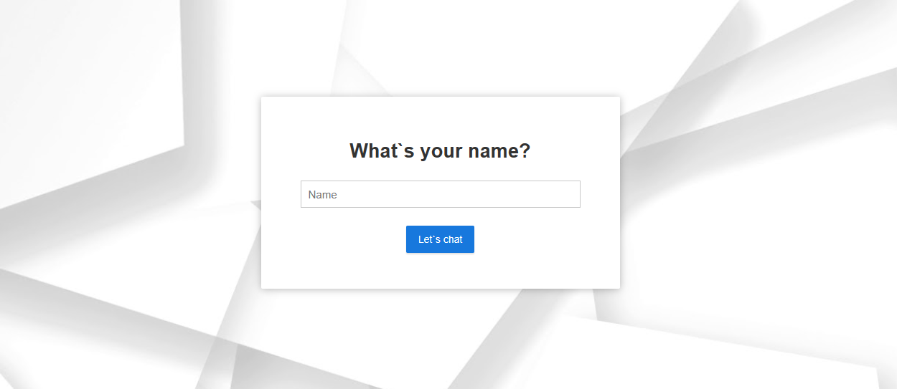
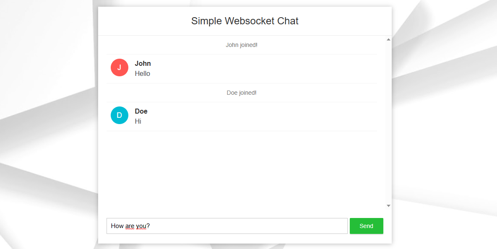

# Simple chat using Spring websocket

Simple chat will let you join the room with name and let you chat with other people.
 It was created based on article from: https://www.callicoder.com/spring-boot-websocket-chat-example/

### Screenshots
1. Enter your name:

2. Write to chat:

### How to build application
Run maven command  
`mvn clean install`